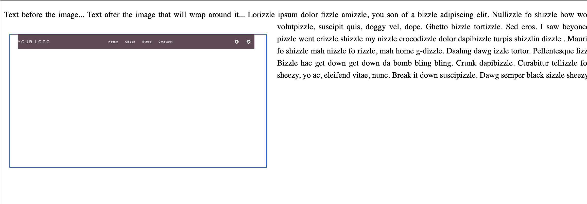
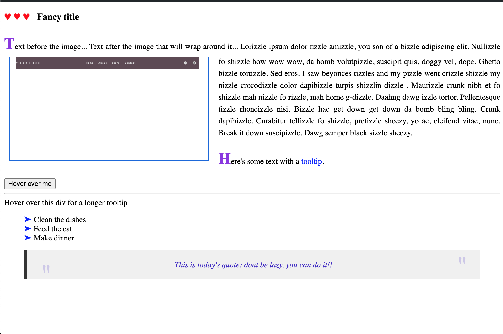

# HTML - CSS 
0. Block elements vs inline elements

* Margin:
-  Inline elements only respect left and right margin
* Padding:
- Inline elements only respect left and right padding
-  Top and bottom padding are applied visually but do not affect layout ( put backgound color to see the padding)

 ---> This behavior is why many developers prefer to use display: inline-block for elements that need full box model behavior while remaining inline, as it respects all margins and padding in terms of layout.

 --> Box model application: Block elements apply the full box model (content, padding, border, margin). Inline elements only apply parts of the box model horizontally (left/right padding and margins)

 * width and height
 - Inline elements ignore width and height settings, default width is the content's width
 - If not specify, block elements take up full width of their parent container by default

 * vertical alginment:
 - Block elements can be vertically aligned using margin
 - Inline elements can be vertically aligned using vertical-align

1. Elements styling
- Inline elemens: span, em, small, big, a, abbreviation, b, button, cite, code,i, img,input, label, q,select,textarea
- Styling:
 * height and width cannot be set
 * Only horizontal margin and padding are respected
 * properties: color, background-color, font-size,  font-family, font-weight, font-style, vertical-align,line-height, text-decoration, padding, margin, border,letter-spacing,text-transform,opacity

- Styling if changed to inline-block:
* extra properties: width,height,top,right,bottom,left, float,clear,min-width/height,max-width/height, overflow,box-sizing,background-image,box-shadow,transform,transition,z-index,visibility - visibile(default),hidden,collapse
* the top and bottom margins though applied do not push away the adjacent inline or inline-block elements vertically. The margin also do not affect the height of line box ( content's height plus top and bottom space).
* the top and bottom paddings same do not affect vertical adjacent elements, but will make content appear bigger since it adjust the position of content inside the line box. 
* text can wrap around inine block elements

- Styling if changed to block:
* extra properties: none compared to inline-block
* fully respected width and height, margins and paddings
* default width is width of parent's element

- Way of switch from inline and inline-block elements to block elements:
* using display property
* using float property : this removes an element from the normal doc flow, makes the element a block-level element in terms of layout behaviour ( set to left, right, inline-start, inline-end, affects layout of subsequent elements, have width and height, respect vertical margins and paddings, stack vertically by default ) 

---> works well for wrapping text around images: below is example of using float with shape-outside: circle(80%); 

2. Pseudo-elements: Pseudo-elements are keywords added to selectors that let you style a specific part of the selected element(s).
- Modern syntax (CSS3+): selector::pseudo-element { property: value; }
- Common pseudo-elements:
::before - Inserts content before the content of an element

::after - Inserts content after the content of an element

::first-line - Styles the first line of a block-level element

::first-letter - Styles the first letter of a block-level element

::selection - Applies styles to the portion of a document that has been highlighted by the user

::placeholder - Styles the placeholder text of form elements

- It is inline element by default, but can be changed to other display. It creates a new box in the document tree. 

- Use cases:
* Adding decorative content: tooltips, custom list styles, Adding quotation marks to blockquotes
* Creating complex layouts without extra markup 
- Limitations: overuse can potentially affect rendering times though generally have minimal impact on performance

3. Stacking context : some properties can create new stacking contexts
-  Creation method: 
* Elements with position: absolute/relative and a z-index value other than auto
* Elements with opacity less than 1
* Elements with transform, filter, or perspective properties
* Flex and grid container children with z-index other than auto
* Elements with isolation: isolate

4. Nav bar

**set up for nav bar:**
-  nav tag to wrap ul elements
-  optional to add wrapper div outside nav as well to keep layout-related styles separated from content styles and maintain a consistent layout across the site
-  Remove default styling:

--->Set list-style-type: none; to remove bullet points 

--->Set margin: 0; and padding: 0; to remove browser default spacing

-  style link consistently( remove underlines, set padding, colors, add hover)
-  Use position: fixed to keep the navbar visible while scrolling

