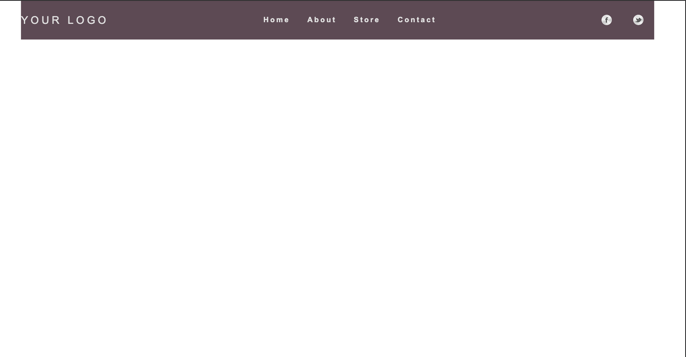

# HTML - CSS 
0. Block elements vs inline elements

* Margin:
-  Inline elements only respect left and right margin
* Padding:
- Inline elements only respect left and right padding
-  Top and bottom padding are applied visually but do not affect layout ( put backgound color to see the padding)

 ---> This behavior is why many developers prefer to use display: inline-block for elements that need full box model behavior while remaining inline, as it respects all margins and padding in terms of layout.

 --> Box model application: Block elements apply the full box model (content, padding, border, margin). Inline elements only apply parts of the box model horizontally (left/right padding and margins)

 * width and height
 - Inline elements ignore width and height settings, default width is the content's width
 - If not specify, block elements take up full width of their parent container by default

 * vertical alginment:
 - Block elements can be vertically aligned using margin
 - Inline elements can be vertically aligned using vertical-align

1. Nav bar

**set up for nav bar:**
-  nav tag to wrap ul elements
-  optional to add wrapper div outside nav as well to keep layout-related styles separated from content styles and maintain a consistent layout across the site
-  Remove default styling:

--->Set list-style-type: none; to remove bullet points 

--->Set margin: 0; and padding: 0; to remove browser default spacing

-  style link consistently( remove underlines, set padding, colors, add hover)
- Use position: fixed; to keep the navbar visible while scrolling

